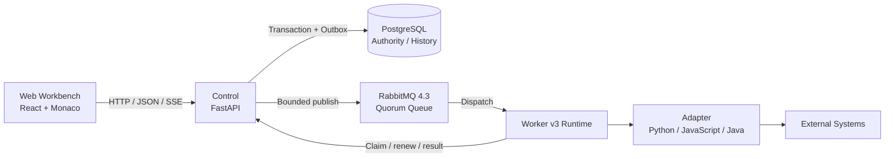

<p align="center">
  
</p>

<p align="center">
  <strong>Code your data connections.</strong>
</p>

<p align="center">
  An AI-assisted, code-first platform for developing and running data adapters.<br>
  Turn scattered integrations, collection scripts, and transformation logic into manageable, runnable, observable Adapters.
</p>

<p align="center">
  <a href="https://github.com/john-ops-lab/DataLinkRuntime/actions/workflows/ci.yml"></a>
  <a href="LICENSE"></a>
  
  
  
</p>

<p align="center">
  <a href="README.md">简体中文</a> ·
  <strong>English</strong> ·
  <a href="docs/en/product.md">Product</a> ·
  <a href="docs/en/architecture.md">Architecture</a> ·
  <a href="https://github.com/john-ops-lab/DataLinkRuntime/issues">Issues</a>
</p>

---

## What is DataLinkRuntime?

Writing a script that reads data from A, transforms it, and writes it to B is usually the easy part.

The hard part starts when that script needs to run for months or years:

**dependencies, configuration, credentials, schedules, webhooks, revisions, workers, live logs, execution history, and troubleshooting.**

DataLinkRuntime (DLR) brings those runtime concerns into one lightweight, self-hosted platform while keeping the actual integration logic as clear, readable code.

```text
API / DB / File / Event
          │
          ▼
     ┌─────────┐
     │ Adapter │   ← your data connection code
     └────┬────┘
          │
          ▼
 Transform / Process
          │
          ▼
 API / DB / System
```

Each **Adapter** is a self-contained data processing unit. You define how data should be handled; DLR provides the environment to develop, save, run, and observe it.

> **DLR does not try to eliminate code with more drag-and-drop nodes. It uses AI to reduce the cost of writing code, then provides a Runtime to operate that code well.**

---

## Why DLR?

Many teams accumulate a long tail of small but important data connections:

- periodically collect data from cloud platforms, Kubernetes, databases, or internal systems;
- map fields, normalize enums, reshape payloads, and move data between APIs;
- receive GitHub, CI/CD, monitoring, or business webhooks and transform or forward them;
- consolidate scripts scattered across servers, Cron, containers, and personal directories;
- quickly connect long-tail data sources to CMDB, ITOM, data platforms, and internal tools.

These jobs often do not need a complex DAG, but they should not remain "a script on some machine" forever.

DLR is designed for the layer in between:

```text
one-off script
      ↓
saved Adapter
      ↓
scheduled / triggered
      ↓
observable Execution
      ↓
maintainable data connection
```

---

## DLR in 30 seconds

### 1. Write an Adapter

All runtimes share one core contract:

```text
Input → handle(context, input) → Output
```

For example, in Python:

```python
def handle(context, input):
    name = input.get("name", "DLR")

    return {
        "message": f"Hello, {name}",
        "source": input,
    }
```

Runtime entry points:

| Runtime | Adapter entry point |
|---|---|
| Python | `def handle(context, input)` |
| JavaScript | `export async function handle(context, input)` |
| Java | `Adapter.handle(Context context, Object input)` |

The runtime exposes non-sensitive configuration, bound secrets, and logging through `context`.

### 2. Save and run

```text
Create → Edit → Save → Run / Schedule → Observe
```

Saving creates an immutable runtime snapshot, and Executions always run from saved content.

### 3. Let DLR handle the runtime

| You focus on | DLR handles |
|---|---|
| Fetching and receiving data | Adapter management |
| Mapping and transformation | Python / JavaScript / Java runtimes |
| Business logic | Dependencies and runtime configuration |
| Writing to target systems | Credentials / Secret Binding |
| The code itself | Task / Cron / Timezone / Webhook |
|  | Worker execution |
|  | Live logs and Execution history |
|  | Saved snapshots and traceability |

---

## Start from the Template Gallery

The top-level **Template Gallery** provides official Recipe starting points shipped
with each DLR release. The initial catalog is fixed at **5 themes, 17 scenarios, and
51 language Variants**. Every scenario has Python, JavaScript, and Java implementations
and shows the selected language's input/output contracts, suggested dependencies,
provenance, and maturity.

```text
Template Gallery → choose a scenario and language → name and copy → automatically edit the new Adapter
```

A copy creates an independent Adapter and Revision 1, not a live reference to the
template. It starts stopped, with no Worker, Credential Binding, installed dependency,
Schedule, or run history. Later template releases never overwrite the copied code.
Before running it, choose a compatible Worker, install the exact declared dependencies,
configure non-secret Runtime values, and supply declared secrets through Credential
Binding. Administrators must review external endpoints; never put passwords, Tokens,
or authentication query values in a URL or source code.

Disabling Managed Input Store does not prevent browsing, viewing, or copying any
template, including CSV and Excel, and copying never creates a file binding. Seven
cloud/CMDB scenarios provide a read-only `preview` whose normalized result and Adapter
Output are bounded by page, record, byte, and total-time limits, plus an optional `sync`
against the external `dlr-cmdb-upsert/v1` contract. Sync requires stable `scan_id` and
`source_scope` values in immutable Execution Input, reused by every retry of that
Execution. The Alibaba Cloud SDK `callApi` transport used by three Alibaba scenarios
does not yet provide a proven source-response byte bound, so that raw HTTP transport is
outside the bounded-output claim.

Maturity is tracked per scenario, version, language, and source hash and is backed by
a Receipt. `reference-generated` means experimental and unverified: there is no Receipt
that both matches the current source hash and satisfies every gate for the next level.
Narrow smoke or security-canary execution is allowed but is not complete fixture or
live-service evidence. See [Template Recipe usage and security boundaries](docs/templates/recipe-usage-security.en.md),
the [CMDB Upsert v1 contract (Simplified Chinese)](docs/templates/cmdb-upsert-v1.md), and
[maturity Receipts (Simplified Chinese)](docs/templates/maturity-receipts.md) for the
precise contracts.

> Recipe URL checks, same-origin redirects, timeouts, and resource limits are not a
> platform-level SSRF or egress-isolation boundary. DLR retains its trusted-admin code
> model; production deployments must restrict Worker egress with firewalls, DNS/proxy
> policy, and destination allowlists.

---

## Key capabilities

| | Capability | Description |
|---|---|---|
| 🧩 | **Code-first Adapters** | Code remains the final asset: readable, editable, testable, and versionable |
| 🧰 | **Template Gallery** | Browse three-language Recipes by theme and scenario, then copy directly into an independent Adapter editor |
| 🖥️ | **Web Workbench** | Create, edit, save, clone, and manage Adapters in the browser |
| ⚡ | **Multi-language Runtime** | Python, JavaScript, and Java share a consistent Input / Output / Log model |
| ⏱️ | **Task & Schedule** | Run manually or schedule with Cron + Timezone |
| 🔔 | **Webhook** | Receive external HTTP events and create asynchronous Executions |
| 🔐 | **Credentials** | Store credentials encrypted and inject them through Secret Binding |
| 📜 | **Live logs & history** | SSE logs, status, duration, Input / Output, and historical Executions |
| 🧱 | **Worker Runtime** | Separate Control from actual Adapter execution |
| ✨ | **AI Assistant** | Generate a Candidate from explicit context, review the Diff, then Apply |
| 🌐 | **Self-hosted & i18n** | Deploy with Docker Compose; Simplified Chinese and English UI |

---

## AI-assisted, human-controlled

DLR's AI Assistant helps you **generate, modify, and understand Adapter code**. It is not an autonomous platform operator.

```text
Working Copy + Explicit Context
              │
              ▼
        AI Assistant
              │
              ▼
          Candidate
              │
              ▼
             Diff
              │
          User Apply
              │
              ▼
      Working Copy (dirty)
```

The AI does not automatically:

- Save
- Run / Stop
- change the Worker
- change Schedule / Webhook lifecycle state
- read credential secret values

**Apply only updates the browser Working Copy. Saving and running always require an explicit user action.**

---

## Where DLR fits

| Good fit for DLR | Better served by other tools |
|---|---|
| System A → transform → System B | Multi-step dependency graphs and complex DAGs |
| API / data format adaptation | Large-scale real-time stream processing |
| CMDB / ITOM / platform data collection | General-purpose enterprise service buses |
| Consolidating Cron scripts into a runtime | Drag-and-drop low-code workflow orchestration |
| GitHub / CI/CD / monitoring webhooks | Untrusted multi-tenant code execution |
| One-off migrations, fixes, and short-lived integrations | General-purpose Serverless runtimes |

DLR focuses on **developing and running independent Adapters**, not Workflow / DAG orchestration.

---

## Quick start

### Prerequisites

- Docker
- Docker Compose v2

### 1. Clone and configure

```bash
git clone https://github.com/john-ops-lab/DataLinkRuntime.git
cd DataLinkRuntime

cp .env.example .env
```

Edit `.env` and set at least:

```text
DLR_ADMIN_TOKEN
DLR_WORKER_TOKEN
DLR_MASTER_KEY
```

Use real random secrets and never commit `.env`.

### 2. Prepare log directories

The local default uses `./platform-logs` inside the repository:

`DLR_PLATFORM_LOG_ROOT=./platform-logs` is the writable local default; use
`/var/lib/dlr/platform-logs` for Linux production. Compose uses a bind mount for
`control/`, `worker/`, `web/`, `account-web/`, and `postgres/`; the `postgres/`
directory must be writable by the PostgreSQL container user. Configure log
rotation and redaction, and never write credentials to logs. Do not use `chmod 777`
to bypass permission problems. The root is precisely ignored by
`.gitignore`.

AI Assist uses `DLR_AI_ASSIST_TOTAL_TIMEOUT_SECONDS=150` as its total deadline.
Tool-call audit metadata is written to `control/ai-tool-audit.jsonl` and rotated
in-process with `DLR_AI_TOOL_AUDIT_MAX_BYTES=10485760` and
`DLR_AI_TOOL_AUDIT_BACKUP_COUNT=10`, for a default maximum footprint of 110 MiB.
Other `*.log` files remain subject to the platform rotation and redaction policy.
For rollback to an older Control/Web that does not recognize these settings,
remove the three variables together and retain existing redacted audit files for
operator handling.

```bash
mkdir -p ./platform-logs/control \
  ./platform-logs/worker \
  ./platform-logs/web \
  ./platform-logs/account-web \
  ./platform-logs/postgres
```

For Linux production paths and permissions, see
[Platform Logs Deployment](docs/deployment/platform-logs.md).

### 3. Initialize the database

```bash
docker compose up -d postgres
docker compose run --rm control alembic upgrade head
```

See [Reliable Runtime migration notes](docs/en/issue130-reliable-runtime-migrations.md)
for the Issue #130 fresh/current-main migration, non-destructive rollback, Cutover
API, and old-binary fail-closed boundary. See
[Sandbox deployment](docs/en/issue130-sandbox-deployment.md) for the Linux cgroup v2
host prerequisites and exact delegated subtree.

### 4. Start DLR

```bash
docker compose up -d --build
docker compose ps
```

The RabbitMQ management listener stays inside the Compose network by default. For
isolated local inspection only, enable the localhost-bound profile explicitly:

```bash
docker compose -f docker-compose.yml -f docker-compose.management.yml \
  --profile management up -d rabbitmq
```

`DLR_RABBITMQ_VHOST` is the one raw vhost value shared by RabbitMQ, Control, and
Worker; Control and Worker encode it when building the AMQP URL. Ordinary RabbitMQ
ingress remains disabled and legacy Claim remains enabled by default. Never skip the
backup/restore, Worker v3/Sandbox, Slot-concurrency, and migration preflight gates by
flipping a single setting.

Once all services are healthy:

| Entry | Address |
|---|---|
| Web Console | `http://localhost:8080` |
| Account Console | `http://localhost:8081` |
| Health API | `http://localhost:8080/api/health` |

Use `DLR_ADMIN_TOKEN` from `.env` for the first Web Console login.

---

## Architecture



Responsibilities:

- **Web** — Adapter development, configuration, execution, and observation;
- **Control** — APIs, authoritative state, scheduling, Webhooks, Credentials, and AI provider integration;
- **PostgreSQL** — authoritative platform state, saved snapshots, and execution history;
- **Worker** — actual execution of user Adapter code.

**Control does not execute Adapter code itself.**

See [Architecture](docs/en/architecture.md) for the detailed contracts.

---

## Core objects

| Object | Meaning |
|---|---|
| **Adapter** | Independent data processing unit; currently Task or Webhook |
| **Revision** | Immutable snapshot of code, dependencies, and runtime parameters created on save |
| **Execution** | One concrete run with status, duration, Input / Output, and logs |
| **Worker** | Node that actually executes Adapters according to runtime capability |
| **Credential** | Encrypted secret material; secret values are never returned to the browser |
| **Attempt / Slot** | One physical RabbitMQ execution attempt and the database concurrency authority for an Adapter |

---

## Reliable execution and runtime boundaries

- PostgreSQL is the business authority for Execution, Admission, Outbox, Attempt,
  Lease, Fencing, and Slot state. RabbitMQ carries bounded dispatch only; it does not
  replace database correctness.
- Worker v3 ACKs a message after durable Claim and private-journal persistence, before
  Sandbox execution. This is **ACK-on-claim**, not ACK-on-completion. Lease Recovery
  creates a new generation after a post-ACK crash.
- One Adapter may have multiple valid `queued/retry_wait` Executions, while database
  `Slot 0` permits at most one active Attempt. Different Adapters may run in parallel.
- The default Compose deployment uses one RabbitMQ node. Quorum Queue durability is
  **not HA** with one node. PostgreSQL Outbox retains accepted responsibility during
  a broker outage and relays it after recovery.
- The v3 Sandbox requires a correctly delegated Linux cgroup v2 host and bounds CPU,
  memory, PIDs, temporary storage, and output. It does not turn DLR into an
  untrusted-tenant arbitrary-code service.

---

## Security model

DLR currently uses a **trusted administrator code model**.

Important boundaries:

- Adapter subprocess isolation is **not a security sandbox**;
- the Linux cgroup v2 Sandbox is a resource/process boundary, not a tenant security
  boundary, and non-Linux environments cannot satisfy the production Sandbox Gate;
- do not allow untrusted users to execute arbitrary code on Workers;
- credential secret values are never returned to the browser;
- secrets are injected only for the target Execution and are included in platform log redaction;
- never hard-code passwords, tokens, or private keys in Adapter source;
- the AI Assistant does not receive credential secret values as normal context;
- AI attachments are sent to the model service configured by the administrator, so do not upload passwords or keys.

---

## Technology stack

| Layer | Technology |
|---|---|
| Web | React 19 · TypeScript · Vite · Ant Design · Monaco Editor · assistant-ui · i18next |
| Control | Python 3.13 · FastAPI · SQLAlchemy 2 · Alembic |
| Database | PostgreSQL 16 |
| Worker | Python · Node.js / npm · JDK 21 / Maven |
| Tooling | uv · pytest · Ruff · mypy |
| Deploy | Docker Compose |

---

## Local development

Backend:

```bash
cd backend
uv sync --frozen
uv run ruff check .
uv run ruff format --check .
uv run mypy
uv run pytest
```

Web:

```bash
cd web
npm ci
npm run lint
npm run typecheck
npm run test
npm run build
```

Full Compose smoke test:

```bash
./scripts/compose-smoke.sh
```

The smoke test uses an isolated local environment and a fake AI provider; it does not call a public AI service.

---

## Documentation & feedback

- [Product definition](docs/en/product.md)
- [Architecture](docs/en/architecture.md)
- [Template Recipe usage and security boundaries](docs/templates/recipe-usage-security.en.md)
- [Template provenance, CMDB contract, and maturity docs (Simplified Chinese)](docs/templates/README.md)
- [Reliable Runtime migration, Cutover API & failure handling](docs/en/issue130-reliable-runtime-migrations.md)
- [Issue #130 Linux Sandbox deployment](docs/en/issue130-sandbox-deployment.md)
- [Specs index and precedence](docs/specs/README.md)
- [Platform logs & deployment](docs/deployment/platform-logs.md)
- [GitHub Issues](https://github.com/john-ops-lab/DataLinkRuntime/issues)

Historical Specs preserve product and architecture decisions. If older documents conflict with the current implementation, follow the precedence rules in `docs/specs/README.md`.

Bug reports, use cases, feature requests, and Pull Requests are welcome.

---

## License

DataLinkRuntime is open source under the [Apache License 2.0](LICENSE).

Copyright (c) 2026 john-ops-lab
