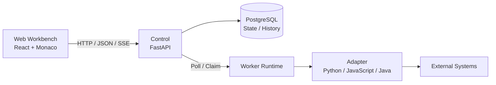

<p align="center">
  
</p>

<p align="center">
  <strong>Code your data connections.</strong>
</p>

<p align="center">
  An AI-assisted, code-first platform for developing and running data adapters.<br>
  Turn scattered integrations, collection scripts, and transformation logic into manageable, runnable, observable Adapters.
</p>

<p align="center">
  <a href="https://github.com/john-ops-lab/DataLinkRuntime/actions/workflows/ci.yml"></a>
  <a href="LICENSE"></a>
  
  
  
</p>

<p align="center">
  <a href="README.md">简体中文</a> ·
  <strong>English</strong> ·
  <a href="docs/en/product.md">Product</a> ·
  <a href="docs/en/architecture.md">Architecture</a> ·
  <a href="https://github.com/john-ops-lab/DataLinkRuntime/issues">Issues</a>
</p>

---

## What is DataLinkRuntime?

Writing a script that reads data from A, transforms it, and writes it to B is usually the easy part.

The hard part starts when that script needs to run for months or years:

**dependencies, configuration, credentials, schedules, webhooks, revisions, workers, live logs, execution history, and troubleshooting.**

DataLinkRuntime (DLR) brings those runtime concerns into one lightweight, self-hosted platform while keeping the actual integration logic as clear, readable code.

```text
API / DB / File / Event
          │
          ▼
     ┌─────────┐
     │ Adapter │   ← your data connection code
     └────┬────┘
          │
          ▼
 Transform / Process
          │
          ▼
 API / DB / System
```

Each **Adapter** is a self-contained data processing unit. You define how data should be handled; DLR provides the environment to develop, save, run, and observe it.

> **DLR does not try to eliminate code with more drag-and-drop nodes. It uses AI to reduce the cost of writing code, then provides a Runtime to operate that code well.**

---

## Why DLR?

Many teams accumulate a long tail of small but important data connections:

- periodically collect data from cloud platforms, Kubernetes, databases, or internal systems;
- map fields, normalize enums, reshape payloads, and move data between APIs;
- receive GitHub, CI/CD, monitoring, or business webhooks and transform or forward them;
- consolidate scripts scattered across servers, Cron, containers, and personal directories;
- quickly connect long-tail data sources to CMDB, ITOM, data platforms, and internal tools.

These jobs often do not need a complex DAG, but they should not remain "a script on some machine" forever.

DLR is designed for the layer in between:

```text
one-off script
      ↓
saved Adapter
      ↓
scheduled / triggered
      ↓
observable Execution
      ↓
maintainable data connection
```

---

## DLR in 30 seconds

### 1. Write an Adapter

All runtimes share one core contract:

```text
Input → handle(context, input) → Output
```

For example, in Python:

```python
def handle(context, input):
    name = input.get("name", "DLR")

    return {
        "message": f"Hello, {name}",
        "source": input,
    }
```

Runtime entry points:

| Runtime | Adapter entry point |
|---|---|
| Python | `def handle(context, input)` |
| JavaScript | `export async function handle(context, input)` |
| Java | `Adapter.handle(Context context, Object input)` |

The runtime exposes non-sensitive configuration, bound secrets, and logging through `context`.

### 2. Save and run

```text
Create → Edit → Save → Run / Schedule → Observe
```

Saving creates an immutable runtime snapshot, and Executions always run from saved content.

### 3. Let DLR handle the runtime

| You focus on | DLR handles |
|---|---|
| Fetching and receiving data | Adapter management |
| Mapping and transformation | Python / JavaScript / Java runtimes |
| Business logic | Dependencies and runtime configuration |
| Writing to target systems | Credentials / Secret Binding |
| The code itself | Task / Cron / Timezone / Webhook |
|  | Worker execution |
|  | Live logs and Execution history |
|  | Saved snapshots and traceability |

---

## Key capabilities

| | Capability | Description |
|---|---|---|
| 🧩 | **Code-first Adapters** | Code remains the final asset: readable, editable, testable, and versionable |
| 🖥️ | **Web Workbench** | Create, edit, save, clone, and manage Adapters in the browser |
| ⚡ | **Multi-language Runtime** | Python, JavaScript, and Java share a consistent Input / Output / Log model |
| ⏱️ | **Task & Schedule** | Run manually or schedule with Cron + Timezone |
| 🔔 | **Webhook** | Receive external HTTP events and create asynchronous Executions |
| 🔐 | **Credentials** | Store credentials encrypted and inject them through Secret Binding |
| 📜 | **Live logs & history** | SSE logs, status, duration, Input / Output, and historical Executions |
| 🧱 | **Worker Runtime** | Separate Control from actual Adapter execution |
| ✨ | **AI Assistant** | Generate a Candidate from explicit context, review the Diff, then Apply |
| 🌐 | **Self-hosted & i18n** | Deploy with Docker Compose; Simplified Chinese and English UI |

---

## AI-assisted, human-controlled

DLR's AI Assistant helps you **generate, modify, and understand Adapter code**. It is not an autonomous platform operator.

```text
Working Copy + Explicit Context
              │
              ▼
        AI Assistant
              │
              ▼
          Candidate
              │
              ▼
             Diff
              │
          User Apply
              │
              ▼
      Working Copy (dirty)
```

The AI does not automatically:

- Save
- Run / Stop
- change the Worker
- change Schedule / Webhook lifecycle state
- read credential secret values

**Apply only updates the browser Working Copy. Saving and running always require an explicit user action.**

---

## Where DLR fits

| Good fit for DLR | Better served by other tools |
|---|---|
| System A → transform → System B | Multi-step dependency graphs and complex DAGs |
| API / data format adaptation | Large-scale real-time stream processing |
| CMDB / ITOM / platform data collection | General-purpose enterprise service buses |
| Consolidating Cron scripts into a runtime | Drag-and-drop low-code workflow orchestration |
| GitHub / CI/CD / monitoring webhooks | Untrusted multi-tenant code execution |
| One-off migrations, fixes, and short-lived integrations | General-purpose Serverless runtimes |

DLR focuses on **developing and running independent Adapters**, not Workflow / DAG orchestration.

---

## Quick start

### Prerequisites

- Docker
- Docker Compose v2

### 1. Clone and configure

```bash
git clone https://github.com/john-ops-lab/DataLinkRuntime.git
cd DataLinkRuntime

cp .env.example .env
```

Edit `.env` and set at least:

```text
DLR_ADMIN_TOKEN
DLR_WORKER_TOKEN
DLR_MASTER_KEY
```

Use real random secrets and never commit `.env`.

### 2. Prepare log directories

The local default uses `./platform-logs` inside the repository:

```bash
mkdir -p ./platform-logs/control \
  ./platform-logs/worker \
  ./platform-logs/web \
  ./platform-logs/account-web \
  ./platform-logs/postgres
```

For Linux production paths and permissions, see
[Platform Logs Deployment](docs/deployment/platform-logs.md).

### 3. Initialize the database

```bash
docker compose up -d postgres
docker compose run --rm control alembic upgrade head
```

### 4. Start DLR

```bash
docker compose up -d --build
docker compose ps
```

Once all services are healthy:

| Entry | Address |
|---|---|
| Web Console | `http://localhost:8080` |
| Account Console | `http://localhost:8081` |
| Health API | `http://localhost:8080/api/health` |

Use `DLR_ADMIN_TOKEN` from `.env` for the first Web Console login.

---

## Architecture



Responsibilities:

- **Web** — Adapter development, configuration, execution, and observation;
- **Control** — APIs, authoritative state, scheduling, Webhooks, Credentials, and AI provider integration;
- **PostgreSQL** — authoritative platform state, saved snapshots, and execution history;
- **Worker** — actual execution of user Adapter code.

**Control does not execute Adapter code itself.**

See [Architecture](docs/en/architecture.md) for the detailed contracts.

---

## Core objects

| Object | Meaning |
|---|---|
| **Adapter** | Independent data processing unit; currently Task or Webhook |
| **Revision** | Immutable snapshot of code, dependencies, and runtime parameters created on save |
| **Execution** | One concrete run with status, duration, Input / Output, and logs |
| **Worker** | Node that actually executes Adapters according to runtime capability |
| **Credential** | Encrypted secret material; secret values are never returned to the browser |

---

## Security model

DLR currently uses a **trusted administrator code model**.

Important boundaries:

- Adapter subprocess isolation is **not a security sandbox**;
- do not allow untrusted users to execute arbitrary code on Workers;
- credential secret values are never returned to the browser;
- secrets are injected only for the target Execution and are included in platform log redaction;
- never hard-code passwords, tokens, or private keys in Adapter source;
- the AI Assistant does not receive credential secret values as normal context;
- AI attachments are sent to the model service configured by the administrator, so do not upload passwords or keys.

---

## Technology stack

| Layer | Technology |
|---|---|
| Web | React 19 · TypeScript · Vite · Ant Design · Monaco Editor · assistant-ui · i18next |
| Control | Python 3.13 · FastAPI · SQLAlchemy 2 · Alembic |
| Database | PostgreSQL 16 |
| Worker | Python · Node.js / npm · JDK 21 / Maven |
| Tooling | uv · pytest · Ruff · mypy |
| Deploy | Docker Compose |

---

## Local development

Backend:

```bash
cd backend
uv sync --frozen
uv run ruff check .
uv run ruff format --check .
uv run mypy
uv run pytest
```

Web:

```bash
cd web
npm ci
npm run lint
npm run typecheck
npm run test
npm run build
```

Full Compose smoke test:

```bash
./scripts/compose-smoke.sh
```

The smoke test uses an isolated local environment and a fake AI provider; it does not call a public AI service.

---

## Documentation & feedback

- [Product definition](docs/en/product.md)
- [Architecture](docs/en/architecture.md)
- [Specs index and precedence](docs/specs/README.md)
- [Platform logs & deployment](docs/deployment/platform-logs.md)
- [GitHub Issues](https://github.com/john-ops-lab/DataLinkRuntime/issues)

Historical Specs preserve product and architecture decisions. If older documents conflict with the current implementation, follow the precedence rules in `docs/specs/README.md`.

Bug reports, use cases, feature requests, and Pull Requests are welcome.

---

## License

DataLinkRuntime is open source under the [Apache License 2.0](LICENSE).

Copyright (c) 2026 john-ops-lab
