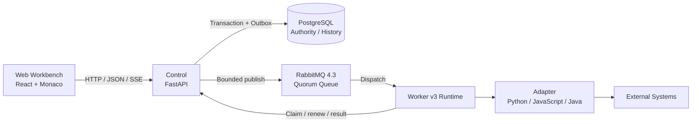

<p align="center">
  
</p>

<p align="center">
  <strong>Code your data connections.</strong>
</p>

<p align="center">
  AI 辅助、代码优先的数据适配开发与运行平台。<br>
  把零散的接口、采集脚本和数据转换逻辑，沉淀为可管理、可运行、可观测的 Adapter。
</p>

<p align="center">
  <a href="https://github.com/john-ops-lab/DataLinkRuntime/actions/workflows/ci.yml"></a>
  <a href="LICENSE"></a>
  
  
  
</p>

<p align="center">
  <strong>简体中文</strong> ·
  <a href="README.en.md">English</a> ·
  <a href="docs/zh-CN/product.md">产品定义</a> ·
  <a href="docs/zh-CN/architecture.md">总体架构</a> ·
  <a href="https://github.com/john-ops-lab/DataLinkRuntime/issues">Issues</a>
</p>

---

## DataLinkRuntime 是什么？

写一段“从 A 取数据、处理后写入 B”的代码并不难。

难的是，当这段代码需要长期运行时，你还要处理：

**依赖、配置、凭据、调度、Webhook、版本、运行节点、实时日志、执行历史和故障排查。**

DataLinkRuntime（DLR）把这些运行时能力统一收进一个轻量、自托管的平台，让数据连接逻辑继续保持为清晰、可读、可修改的代码。

```text
API / DB / File / Event
          │
          ▼
     ┌─────────┐
     │ Adapter │   ← 你的数据连接代码
     └────┬────┘
          │
          ▼
 Transform / Process
          │
          ▼
 API / DB / System
```

每个 **Adapter** 都是一个自包含的数据处理单元。你负责描述“数据怎么处理”，DLR 负责让它能够被开发、保存、运行和观察。

> **DLR 不试图用更多拖拽节点消灭代码，而是用 AI 降低写代码的成本，再用 Runtime 管好代码的长期运行。**

---

## 为什么做 DLR？

很多组织里都存在大量这样的“小型数据连接”：

- 从云平台、Kubernetes、数据库或业务系统定时采集数据；
- 把一个 API 的字段、枚举和数据结构转换后写入另一个系统；
- 接收 GitHub、CI/CD、监控或业务系统 Webhook，再校验、转换和转发；
- 把散落在服务器、Cron、容器和个人目录里的脚本统一管理；
- 为 CMDB、ITOM、数据平台或内部工具快速补齐长尾数据源。

这些任务通常不需要一套复杂的 DAG，却又不应该永远停留在“某台机器上的一个脚本”。

DLR 希望补上中间这一层：

```text
一次性脚本
    ↓
可保存的 Adapter
    ↓
可调度 / 可触发
    ↓
可观测的 Execution
    ↓
可持续维护的数据连接能力
```

---

## 30 秒理解 DLR

### 1. 写一个 Adapter

三种语言共享同一个运行模型：

```text
Input → handle(context, input) → Output
```

例如 Python：

```python
def handle(context, input):
    name = input.get("name", "DLR")

    return {
        "message": f"Hello, {name}",
        "source": input,
    }
```

对应入口：

| Runtime | Adapter 入口 |
|---|---|
| Python | `def handle(context, input)` |
| JavaScript | `export async function handle(context, input)` |
| Java | `Adapter.handle(Context context, Object input)` |

运行时通过 `context` 提供非敏感配置、已绑定 Secret 和日志能力。

### 2. 保存并运行

```text
Create → Edit → Save → Run / Schedule → Observe
```

保存后，DLR 为运行内容保留不可变快照；Execution 始终基于已保存内容执行。

### 3. 让 DLR 管运行时

你不需要为每段脚本重新搭一套运行框架：

| 你专注于 | DLR 负责 |
|---|---|
| 数据获取与接收 | Adapter 管理 |
| 字段映射与转换 | Python / JavaScript / Java Runtime |
| 业务处理逻辑 | 依赖与运行参数 |
| 写入目标系统 | Credential / Secret Binding |
| 代码本身 | Task / Cron / Timezone / Webhook |
|  | Worker 执行 |
|  | 实时日志与 Execution 历史 |
|  | 保存快照与运行追踪 |

---

## 核心能力

| | 能力 | 说明 |
|---|---|---|
| 🧩 | **Code-first Adapter** | Adapter 是最终资产，可直接阅读、修改、测试和版本化 |
| 🖥️ | **Web Workbench** | 在浏览器中创建、编辑、保存、Clone 和管理 Adapter |
| ⚡ | **多语言 Runtime** | Python、JavaScript、Java 使用一致的 Input / Output / Log 模型 |
| ⏱️ | **Task & Schedule** | 手动运行，或通过 Cron + Timezone 定时执行 |
| 🔔 | **Webhook** | 接收外部 HTTP 事件并异步创建 Execution |
| 🔐 | **Credential** | 加密保存凭据，通过 Secret Binding 按执行注入 |
| 📜 | **实时日志与历史** | SSE 实时日志、状态、耗时、Input / Output 与历史 Execution |
| 🧱 | **Worker Runtime** | Control 与实际代码执行分离，由 Worker 承担 Adapter Execution |
| ✨ | **AI Assistant** | 根据代码、日志和显式上下文生成 Candidate，经 Diff 确认后 Apply |
| 🌐 | **自托管与国际化** | Docker Compose 部署，提供简体中文 / English 界面 |

---

## AI 辅助，但执行权始终在人手里

DLR 的 AI Assistant 用来帮助你**生成、修改和理解 Adapter 代码**，而不是替你自主操作平台。

```text
Working Copy + Explicit Context
              │
              ▼
        AI Assistant
              │
              ▼
          Candidate
              │
              ▼
             Diff
              │
          User Apply
              │
              ▼
      Working Copy (dirty)
```

AI 不会自动替你执行：

- Save
- Run / Stop
- 修改 Worker
- 修改 Schedule / Webhook 生命周期
- 读取 Credential 真值

**Apply 只是把候选修改放回 Working Copy；最终保存与运行必须由用户明确触发。**

---

## 适合什么场景？

| 适合 DLR | 更适合其他工具 |
|---|---|
| 系统 A → 转换 → 系统 B | 多任务依赖和复杂 DAG |
| API / 数据格式适配 | 大规模实时流计算 |
| CMDB / ITOM / 平台数据采集 | 通用企业服务总线 |
| Cron 脚本收敛与长期运行 | 拖拽式低代码流程编排 |
| GitHub / CI/CD / 监控 Webhook | 面向不可信租户的代码执行平台 |
| 一次性迁移、修正、短期接口任务 | 通用 Serverless Runtime |

DLR 专注的是 **独立 Adapter 的开发和运行**，而不是 Workflow / DAG 编排。

---

## 快速开始

### 前置条件

- Docker
- Docker Compose v2

### 1. 克隆并创建配置

```bash
git clone https://github.com/john-ops-lab/DataLinkRuntime.git
cd DataLinkRuntime

cp .env.example .env
```

编辑 `.env`，至少设置：

```text
DLR_ADMIN_TOKEN
DLR_WORKER_TOKEN
DLR_MASTER_KEY
```

请替换为真实随机 Secret，不要提交 `.env`。

### 2. 准备日志目录

本地默认使用仓库内的 `./platform-logs`：

```bash
mkdir -p ./platform-logs/control \
  ./platform-logs/worker \
  ./platform-logs/web \
  ./platform-logs/account-web \
  ./platform-logs/postgres
```

Linux 生产部署的路径和权限要求请查看
[平台日志部署文档](docs/deployment/platform-logs.md)。

### 3. 初始化数据库

```bash
docker compose up -d postgres
docker compose run --rm control alembic upgrade head
```

Issue #130 的 fresh/current-main migration、非破坏回滚和旧二进制 fail-closed
边界见 [Reliable Runtime 迁移说明](docs/zh-CN/issue130-reliable-runtime-migrations.md)。
Linux cgroup v2 的部署前置、精确 delegated subtree 与故障矩阵见
[Sandbox 部署说明](docs/zh-CN/issue130-sandbox-deployment.md)。

### 4. 启动 DLR

```bash
docker compose up -d --build
docker compose ps
```

RabbitMQ 的 management listener 默认只在 Compose 服务网络内可用，不发布到宿主机。
隔离开发需要查看 management API 时，显式启用仅绑定 localhost 的 profile：

```bash
docker compose -f docker-compose.yml -f docker-compose.management.yml \
  --profile management up -d rabbitmq
```

`DLR_RABBITMQ_VHOST` 是 Broker、Control 和 Worker 共用的唯一原始 vhost 配置；
Control/Worker 在建立 AMQP 连接时负责安全 URL 编码，不能另行维护 URL path。
默认配置仍关闭 RabbitMQ 普通流量，并保留 legacy Claim；不要只修改一个开关就跳过
备份恢复、Worker v3/Sandbox、Slot 并发和迁移 preflight。完整、不可交换的 Cutover
顺序见上面的迁移说明。

服务健康后：

| 入口 | 地址 |
|---|---|
| Web Console | `http://localhost:8080` |
| Account Console | `http://localhost:8081` |
| Health API | `http://localhost:8080/api/health` |

首次进入 Web Console 使用 `.env` 中的 `DLR_ADMIN_TOKEN`。

> 想了解完整部署参数、日志轮转和生产路径，请阅读 [部署文档](docs/deployment/platform-logs.md)。

---

## 架构



核心职责：

- **Web**：Adapter 开发、配置、运行和观察；
- **Control**：API、状态、事务门禁、调度、Webhook、Credential、AI Provider 集成；
- **PostgreSQL**：平台权威状态、保存快照和执行历史；
- **Worker**：真正执行用户 Adapter 代码。

**Control 本身不执行 Adapter 代码。**

详细设计见 [总体架构](docs/zh-CN/architecture.md)。

---

## 核心对象

| 对象 | 含义 |
|---|---|
| **Adapter** | 独立的数据处理单元，当前类型为 Task 或 Webhook |
| **Revision** | 每次保存形成的不可变代码、依赖与运行参数快照 |
| **Execution** | 一次具体运行，记录状态、耗时、Input / Output 与日志 |
| **Worker** | 实际执行 Adapter 的节点，按 Runtime capability 参与调度 |
| **Credential** | 加密保存的凭据；浏览器不会获得 Secret 真值 |
| **Attempt / Slot** | RabbitMQ Execution 的一次实际执行及每个 Adapter 的数据库并发权威 |

---

## 可靠执行与运行边界

- PostgreSQL 是 Execution、Admission、Outbox、Attempt、Lease、Fencing 与 Slot 的业务
  权威；RabbitMQ 只承载有界 dispatch，不替代数据库正确性。
- Worker v3 在 durable Claim 与私有 journal 成功后 ACK 消息，再进入 Sandbox 执行；
  因此这是 **ACK-on-claim**，不是执行完成后 ACK。ACK 后崩溃由 Lease Recovery 创建
  新 generation 恢复。
- 同一 Adapter 可以存在多个合法 `queued/retry_wait` Execution，但数据库 `Slot 0`
  保证同一时刻最多一个 active Attempt；不同 Adapter 可以并行。
- 默认 Compose 使用单节点 RabbitMQ。Quorum Queue 提供持久化语义，但单节点仍然
  **不是 HA**；Broker 故障期间 PostgreSQL Outbox 保留已接受责任，恢复后补发。
- v3 Sandbox 仅在满足部署前置的 Linux cgroup v2 环境成立，用于限制 CPU、内存、
  PID、临时磁盘与输出；它不把 DLR 变成面向不可信租户的任意代码平台。

---

## 安全模型

DLR 当前采用 **可信管理员代码模型**。

请特别注意：

- Adapter 子进程隔离 **不等同于安全沙箱**；
- Linux cgroup v2 Sandbox 是资源与进程边界，不是租户安全边界；非 Linux 环境不能
  声称通过生产 Sandbox Gate；
- 不应允许不可信用户在 Worker 上执行任意代码；
- Credential 真值不会返回浏览器；
- Secret 仅按目标 Execution 注入，并参与平台日志脱敏；
- 不要在 Adapter 源码中硬编码密码、Token 或私钥；
- AI Assistant 不会把 Credential 真值作为正常上下文发送给模型；
- AI 附件会发送给管理员配置的模型服务，不应上传密码、密钥等敏感凭据。

---

## 技术栈

| 层 | 技术 |
|---|---|
| Web | React 19 · TypeScript · Vite · Ant Design · Monaco Editor · assistant-ui · i18next |
| Control | Python 3.13 · FastAPI · SQLAlchemy 2 · Alembic |
| Database | PostgreSQL 16 |
| Worker | Python · Node.js / npm · JDK 21 / Maven |
| Tooling | uv · pytest · Ruff · mypy |
| Deploy | Docker Compose |

---

## 本地开发

Backend：

```bash
cd backend
uv sync --frozen
uv run ruff check .
uv run ruff format --check .
uv run mypy
uv run pytest
```

Web：

```bash
cd web
npm ci
npm run lint
npm run typecheck
npm run test
npm run build
```

完整 Compose 冒烟测试：

```bash
./scripts/compose-smoke.sh
```

Smoke Test 使用隔离的本地环境和 fake AI Provider，不会访问公网 AI 服务。

---

## 文档与反馈

- [产品定义](docs/zh-CN/product.md)
- [总体架构](docs/zh-CN/architecture.md)
- [Reliable Runtime 迁移、Cutover API 与故障处理](docs/zh-CN/issue130-reliable-runtime-migrations.md)
- [Issue #130 Linux Sandbox 部署](docs/zh-CN/issue130-sandbox-deployment.md)
- [Specs 索引与冲突优先级](docs/specs/README.md)
- [平台日志与部署](docs/deployment/platform-logs.md)
- [GitHub Issues](https://github.com/john-ops-lab/DataLinkRuntime/issues)

历史 Specs 用于保留产品与架构演进记录；如果历史文档与当前实现冲突，请遵循
`docs/specs/README.md` 中定义的优先级。

欢迎通过 Issues 提交 Bug、使用场景和功能建议；代码贡献也欢迎通过 Pull Request 提交。

---

## License

DataLinkRuntime 基于 [Apache License 2.0](LICENSE) 开源。

Copyright (c) 2026 john-ops-lab
